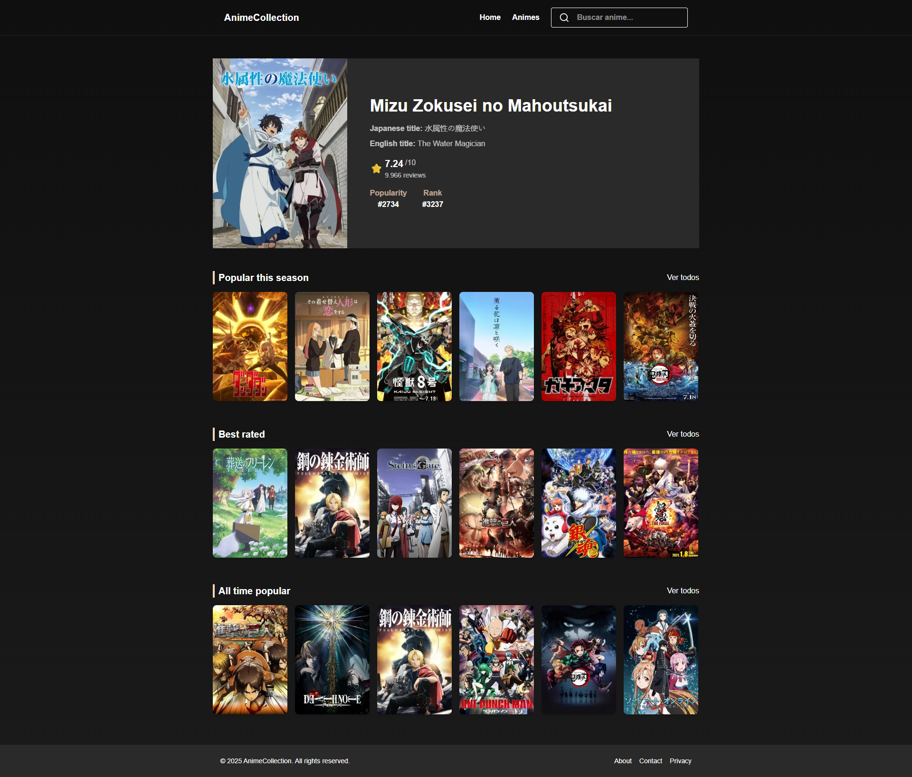
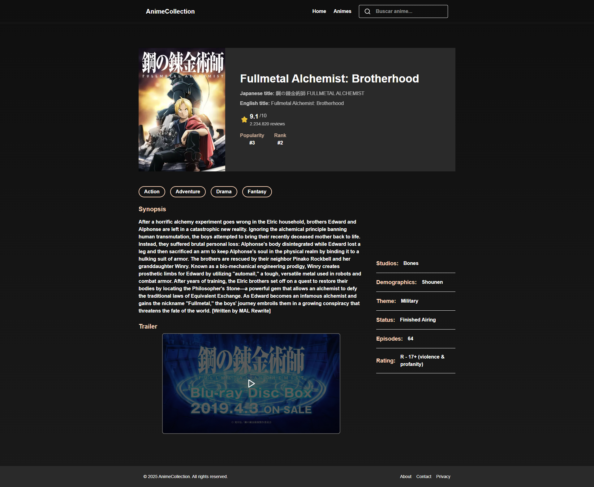
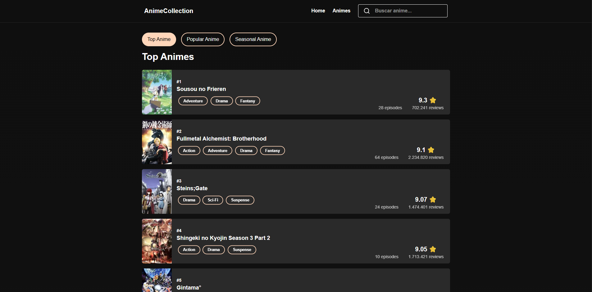

# Anime Collection

A full-stack web application designed to help users discover, track, and manage their personal manga and anime collections. Search for your favorite series, view detailed information, and build your personalized library.

This project was built with a modern tech stack, featuring a **Spring Boot** backend and a **Next.js** frontend, demonstrating a robust, scalable, and decoupled architecture.

---

### ✨ Live Demo

_[Link to the deployed application](https://frontend-anime.onrender.com/)_

### 📸 Screenshots

#### Home page



#### Details page



#### List page



---

## 🚀 Key Features

- **Dynamic Search**: Instantly search for anime with a live, debounced search bar that provides real-time suggestions.
- **Detailed Views**: Click on any series to navigate to a dedicated page with more information.
- **Personalized Collections**: (Future Feature) Users can create an account to add series to custom lists like "Watching", "Completed", or "Plan to Watch".
- **Responsive Design**: A clean and modern UI built with Tailwind CSS that works seamlessly on both desktop and mobile devices.
- **RESTful API**: A well-structured backend API to serve data to the frontend client.

---

## 🛠️ Tech Stack

This project is a full-stack application with a clear separation between the frontend and backend.

### Frontend

| Tech                                              | Description                                                                      |
| :------------------------------------------------ | :------------------------------------------------------------------------------- |
| **[Next.js](https://nextjs.org/)**                | A React framework for building server-side rendered and static web applications. |
| **[React](https://reactjs.org/)**                 | A JavaScript library for building user interfaces.                               |
| **[TypeScript](https://www.typescriptlang.org/)** | A typed superset of JavaScript that enhances code quality and maintainability.   |
| **[Tailwind CSS](https://tailwindcss.com/)**      | A utility-first CSS framework for rapid UI development.                          |
| **[Lucide React](https://lucide.dev/)**           | A beautiful and consistent icon library.                                         |

### Backend

| Tech                                                                           | Description                                                                       |
| :----------------------------------------------------------------------------- | :-------------------------------------------------------------------------------- |
| **[Spring Boot](https://spring.io/projects/spring-boot)**                      | A framework for creating stand-alone, production-grade Spring-based applications. |
| **[Java](https://www.java.com/)**                                              | A robust, object-oriented programming language.                                   |
| **[Spring Data JPA](https://spring.io/projects/spring-data-jpa)**              | Simplifies data access layers by reducing boilerplate code.                       |
| **[PostgreSQL (Not in the current app version)](https://www.postgresql.org/)** | A powerful, open-source object-relational database system.                        |
| **[Maven](https://maven.apache.org/)**                                         | A powerful project management and build automation tool.                          |

---

## ⚙️ Getting Started

To get a local copy up and running, follow these simple steps.

### Prerequisites

Make sure you have the following installed on your machine:

- Java 17+
- Maven 3+
- Node.js v18+
- npm
- A running instance of PostgreSQL (not necessary for the current version)

### Backend Setup

1. **Clone the repository:**

   ```sh
   git clone https://github.com/your-username/manga-collection.git
   cd manga-collection/backend
   ```

2. **Configure the database (not necessary on the current version):**

   - Open `src/main/resources/application.properties`.
   - Update the `spring.datasource.url`, `spring.datasource.username`, and `spring.datasource.password` properties with your PostgreSQL credentials.
   - (Alternatively, you can comment out the PostgreSQL properties to use the default H2 in-memory database).

3. **Run the backend server:**
   ```sh
   mvn spring-boot:run
   ```
   The backend will be running at `http://localhost:8080`.

### Frontend Setup

1. **Navigate to the frontend directory:**

   ```sh
   cd ../frontend/manga-collection
   ```

2. **Install dependencies:**

   ```sh
   npm install
   ```

3. **Set up environment variables:**

   - Create a file named `.env.local` in the `frontend/manga-collection` directory.
   - Add the following line to connect to your local backend API:
     ```
     NEXT_PUBLIC_API_URL=http://localhost:8080
     ```

4. **Run the development server:**
   ```sh
   npm run dev
   ```
   Open http://localhost:3000 with your browser to see the result.

---

## 💡 Future Improvements

- [ ] **User Authentication**: Implement JWT-based authentication for user registration and login.
- [ ] **Collection Management**: Allow users to add/remove anime/manga from their personal lists.
- [ ] **Advanced Filtering**: Add options to filter the anime list by genre, year, or status.
- [ ] **UI/UX Enhancements**: Add more animations and improve the overall user experience.

---

## 👨‍💻 Author

**[Eduardo Miyake]**

- GitHub: [@dudumiyake](https://github.com/duduMiyake)
- LinkedIn: [Eduardo Miyake](https://www.linkedin.com/in/eduardo-miyake/)

Feel free to reach out if you have any questions or suggestions!
